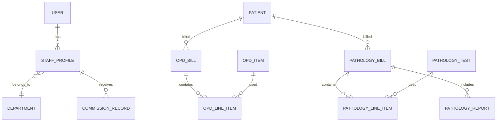

# ER Diagram (Mermaid)

```mermaid
erDiagram
    USER ||--o{ STAFF_PROFILE : has
    STAFF_PROFILE }o--|| DEPARTMENT : belongs_to
    PATIENT ||--o{ OPD_BILL : billed
    PATIENT ||--o{ PATHOLOGY_BILL : billed
    OPD_BILL ||--o{ OPD_LINE_ITEM : contains
    PATHOLOGY_BILL ||--o{ PATHOLOGY_LINE_ITEM : contains
    PATHOLOGY_BILL ||--o{ PATHOLOGY_REPORT : includes
    OPD_ITEM ||--o{ OPD_LINE_ITEM : used
    PATHOLOGY_TEST ||--o{ PATHOLOGY_LINE_ITEM : used
    STAFF_PROFILE ||--o{ COMMISSION_RECORD : receives
```
